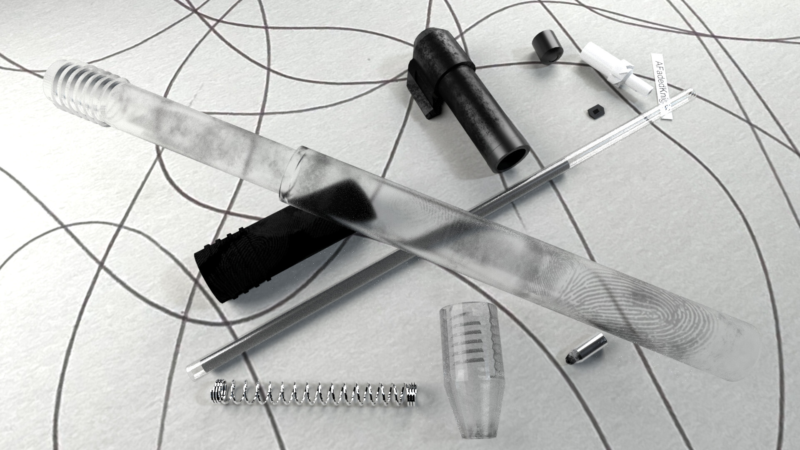
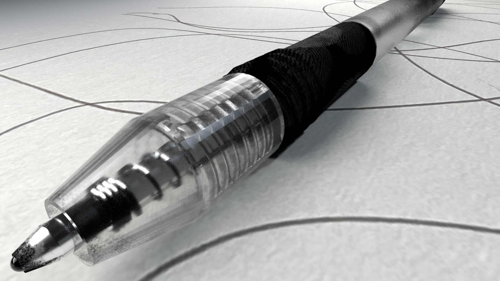

One of the first things we needed to make for my second CGI class was a fully modeled and textured pen. The idea of the assignment was to take a pen you had and photograph your own reference images of the pen to help you recreate it to the correct size and scale in Maya.

## Project Details

As one of the requirements being that one of the renders needed to be an exploded view, this required taking a lot of reference photos as well as breaking down the real life pen to create a perfect representation of every piece in 3D.

This project further helped me in creating accurate one to one recreations of a real world objects in a 3D software.