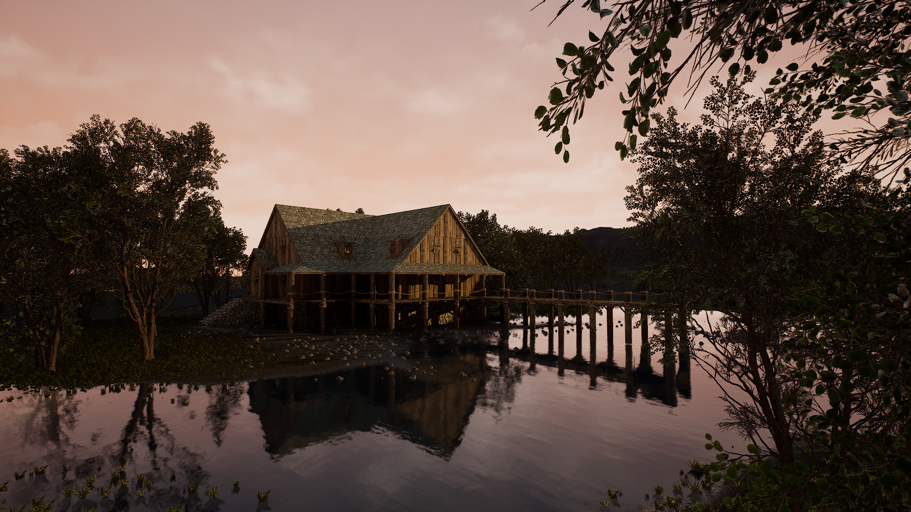
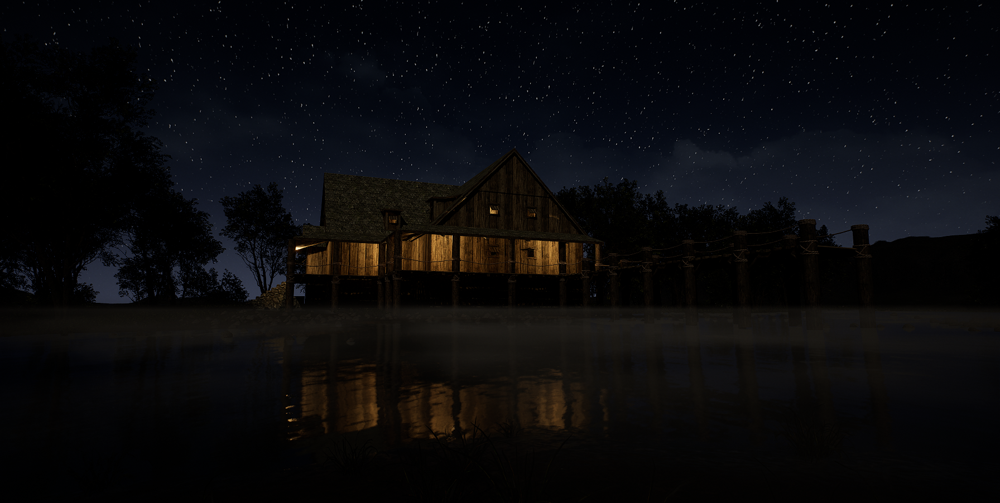

    <iframe width="560" height="315" src="https://www.youtube.com/embed/EEJm7xgDOPA?si=mdUe9Eg8GTw9Z-6q" title="YouTube video player" frameborder="0" allow="accelerometer; autoplay; clipboard-write; encrypted-media; gyroscope; picture-in-picture; web-share" allowfullscreen></iframe>

I have Learned a lot about In Camera VFX(ICVFX) this past year and have constantly been wanting to get to work on my own shot. Finally getting some time and having a class that allowed me to do one as a project I was finally able to do my first shot.

Although I got the oppurtunity to work on an ICVFX shot and live stream before I never really got the chance to to get as much hands on experience eith the tech as I wanted. This project gave me the chance to setup a camera tracking system as well as operate the camera to move in a scene that I created

At the time I started this project I had recently gotten an auto landscape material that would do a lot of the environment work for me. I was then able to find a spot in the landscape I created in Gaea that looked really nice with the auto material. I liked the idea of creating a little lakehouse so I found some assets from a pack I had that fit perfectly.

I had messed around with the the environment a bit messing with an orangey evening time and considered doing night but ended up going with afternoon like lighting in the final shot to give myself the best chance of recreating it in the studio. The picture to the left is a night time version of the scene I created after the project to test out volume textures/materials.