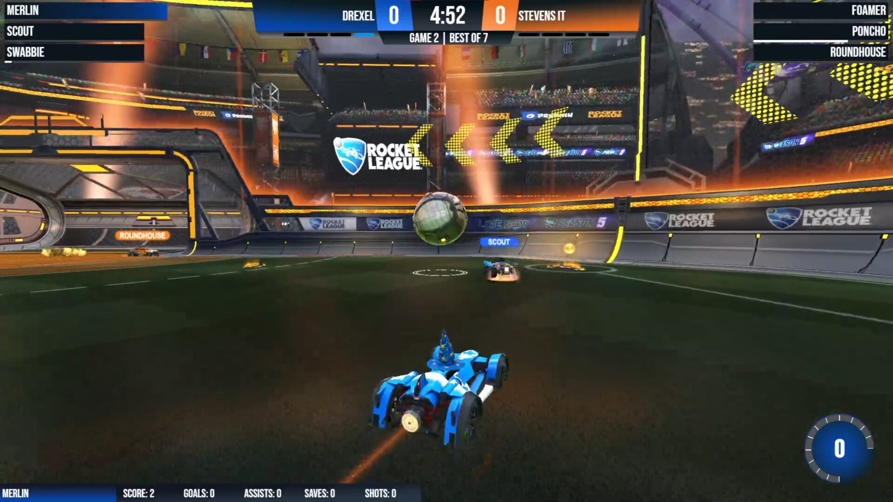
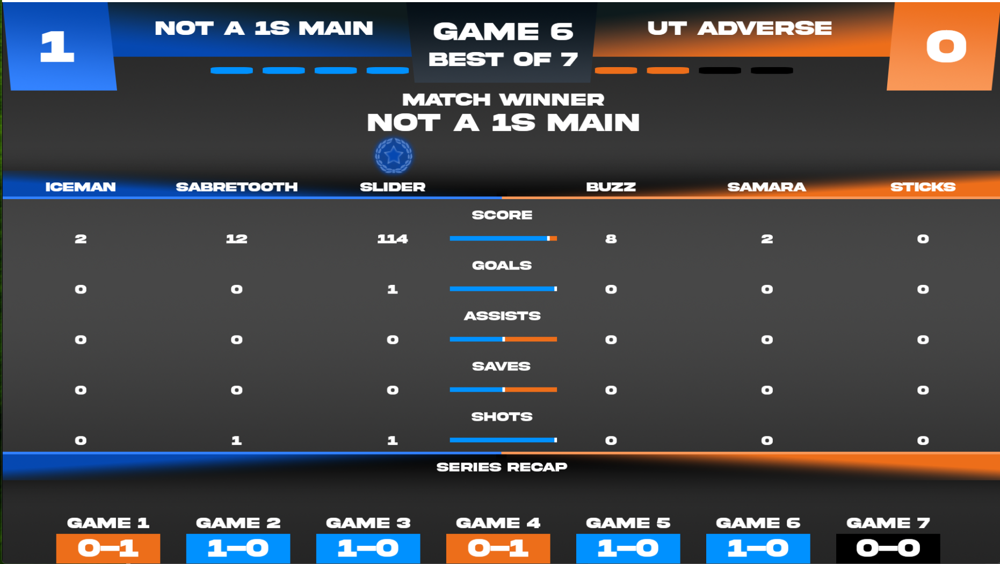

One step many people take to up a live broadcast is to add more personality to the stream. For Rocket league a huge way of doing that while increasing the visuals for the viewer is by adding custom scoreboard overlays to replace the in game one. This adds more personality to the broadcast and can give the viewer even more information on the game in a cleaner way than before.

This Overlay was designed based off the one used in Rocket League Championship Series(RLCS) broadcasts on the official Rocket League Twitch. It includes more info like all players boost and team names all in a customized uniform design. With these additions it actually takes up less primary space on the screen allowing viewers to get more visability on what is happening on the field.

Another feature I created was a post game stats screen that would include a better visualization of the game that was played as well as a recap of all the matches scores at the bottom and who won that game.

I have personally used this Overlay on my own broadcasts but it was also sold being used on a couple other twitch channels. There are other overlays I have also created another of which also sold for use on another channel.