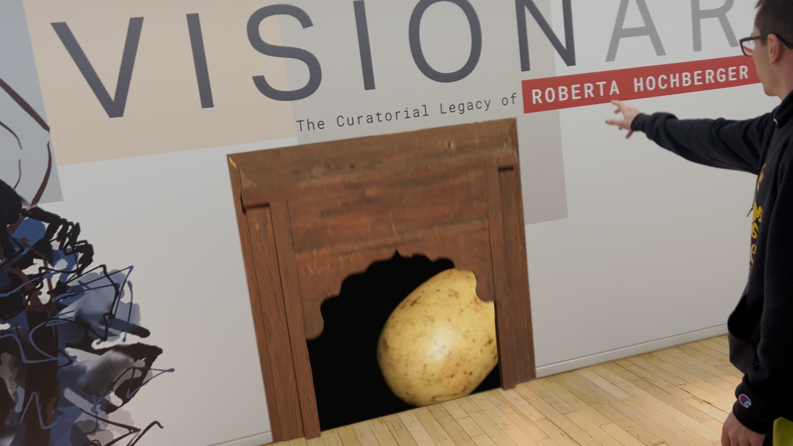
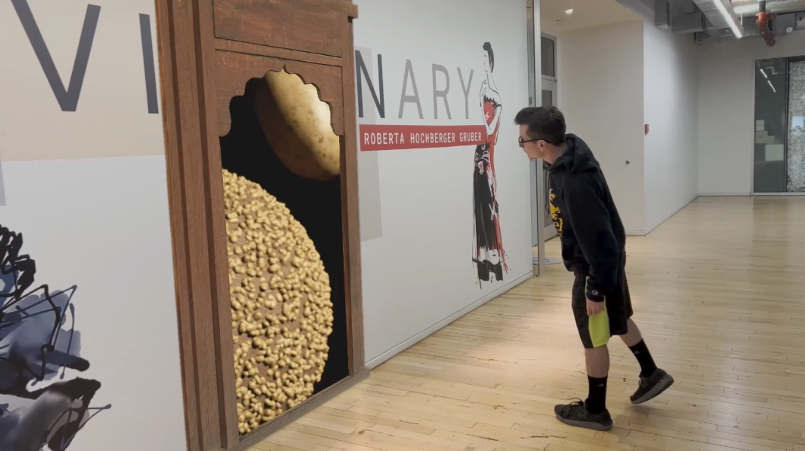

For mycompositing 2 class we were required create a final composite that involved doing some sort of trackin. We could do Object tracking or 3d track a scene both we would ultimately composite 3D elements into a shot we recorded.

    <iframe width="560" height="315" src="https://www.youtube.com/embed/YplpoHZd3js" title="YouTube video player" frameborder="0" allow="accelerometer; autoplay; clipboard-write; encrypted-media; gyroscope; picture-in-picture; web-share" allowfullscreen></iframe>

For my project I decided that I would have a super power and be able to open a door to a potato realm. Thisidea was because the group I was a part of although we were not working together on the shots we wanted to have a theme which was potato themed powers.

I used syntheyes to track the footage as well as export the track to maya. I did a little bit of cleaning up on the track to make sure it was good then exported some placeholder geamoetry and the camera separtately into one unreal project where I did the final rendering for the composite.

The final clean composite of combining the renders from unreal with the plates recorded was all done using Nuke. I reandered many different passes to get subtle detail like reflections and get just the right final look for the shot for everything to match.

