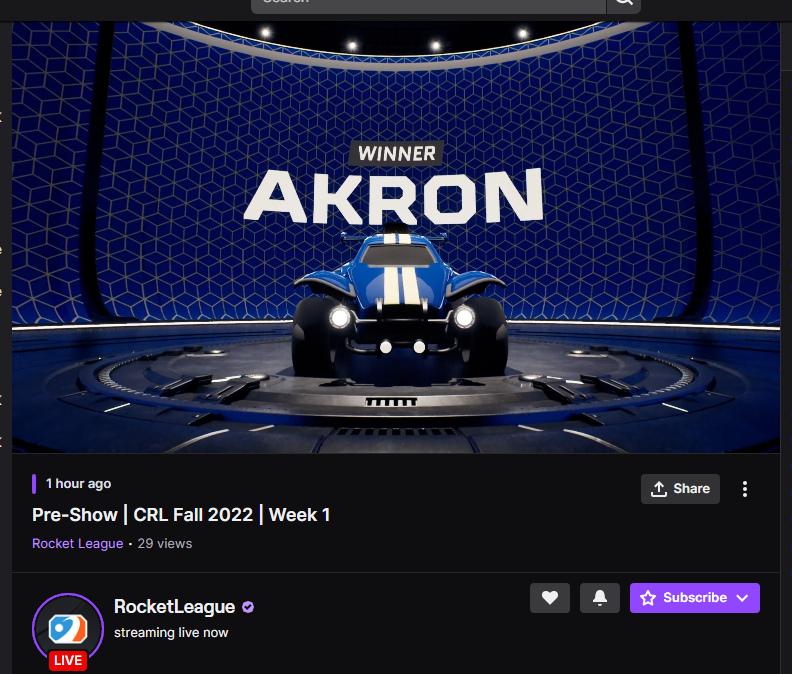
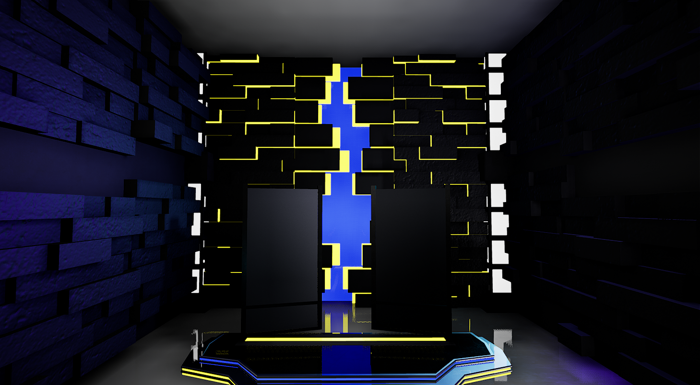
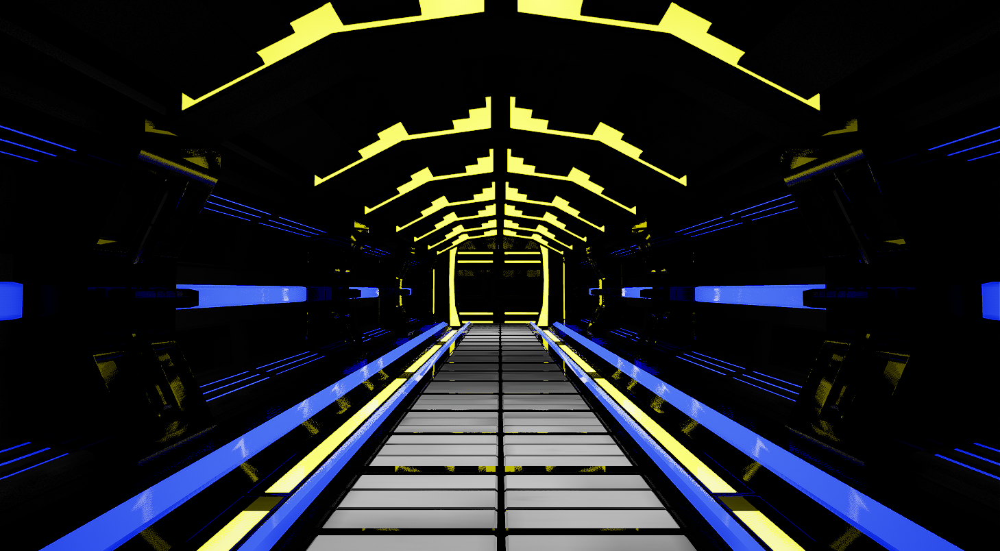
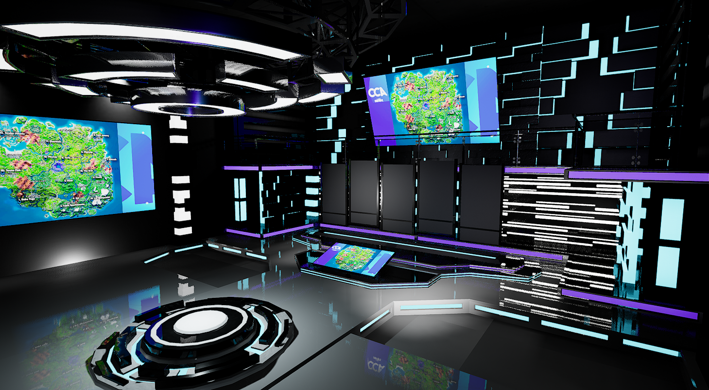
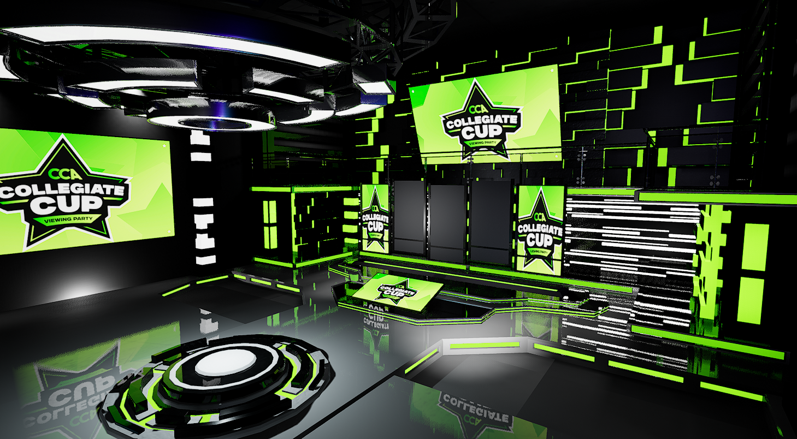
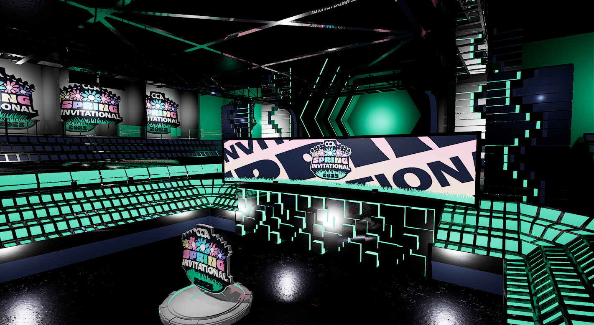
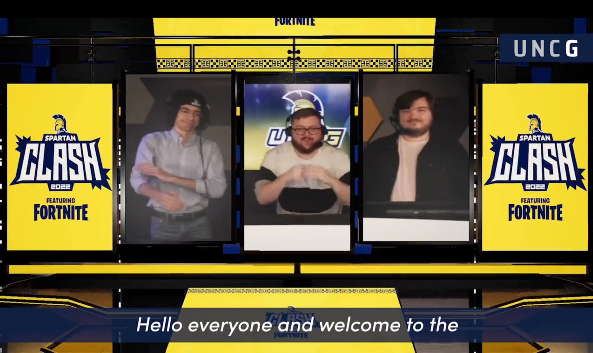

# CRL Hype Chamber

Epic Games released a project called broadcast package nicknamed the "Hype Chamber" which is what it is called from it being used on broadcasts. Collegiate Rocket League (CRL) is the official College league for Rocket League and they wanted to use their own version of this project on their broadcasts. I modified the exsisting project changing the looks as well as adding additional features needed for CRL.

## What I did

The big visable changes can moslty be seen in this image shown on the right. One being the background on the screens being a different look to try and help blend it with the rest of the stream's elements. Another big change was removing the use of Logos and adding text into the animation to still know the teams playing.

There are more animations and smaller visual differences that have been changed but a large majority of what has been done doesn't get seen. This includes many automation and controls to allow many renders to be setup and completed as swiftly as possible.

Changes that were done included adding functionality to support switching 6 different color ways for each of the teams, and lots of additional automation to the scene updating for elements such as text, lights, textures, and materials to remove the need for the user to manually make those changes.

As mentioned before the idea was for this to be used on for CRL productions. 5 different renders would be created for each game adding up to 25 for each of the Weekly broadcast streams, which there were 2 of a week. The first in the week being on the College Carball twitch and the second being streamed on the official Rocket League twitch channel also being the home for RLCS broadcasts.

# eFuse Virtual Studios

Unreal Engine is becoming more and more popular which really lead me to wanting to work with it. First I started using it for traditional 3D art ,like rendering a simple scene, but I quickly discovered it has the power to do much more than that. Discovering its capabilities pushed me to wanting to be able to put myself into a Virtual world eventually leading me to this project.

## What is it

EFVS is a project, lead by me, that is designed for colleges to have access to a Virtual studio to use for their own productions(Primarily aimed towards esports). This studio supports being able to create custom themes that can be saved and easily swithed to during live broadcasts. This allows for doing streams with different amounts of Hosts/Analysts/Casters and swithing those numbers live as well as switching branding mid stream.

## My Part

I primarily worked on the function of the studio in the project. Using a data table I created the feature to add custom "skins" to the studio allowing different use cases and branding that can be easily switched through using the controller. I also made the camera moves used to navigate through the studio along with the HUD to control and view the camera. Although I didn't model much in the studio I did help in adding materials onto the models.

This project has evolved to have even more than just one studio. Studio A is the original but we now have a Studio B which I designed and modeled the assets for. For the most part it has the same features but we added a little bit more for a bit of spice. The biggest additions was using DMX fixtures for more hype as well as a new area for doing recaps of games played. More to come on Studio B as it is still brand new.

## Uses

UNC Greensboro hosted a LAN Fortnite event which is an in person esports competion where high school and college students competed for prizing. For the broadcast streamed on UNCG's esports Twitch channel, they wanted to use this project. I quickly created a custom version of the studio for the event as well as operated the project during the broadcast

    <iframe width="560" height="315" src="https://www.youtube.com/embed/1POvIT2rx-4" title="YouTube video player" frameborder="0" allow="accelerometer; autoplay; clipboard-write; encrypted-media; gyroscope; picture-in-picture" allowfullscreen></iframe>

