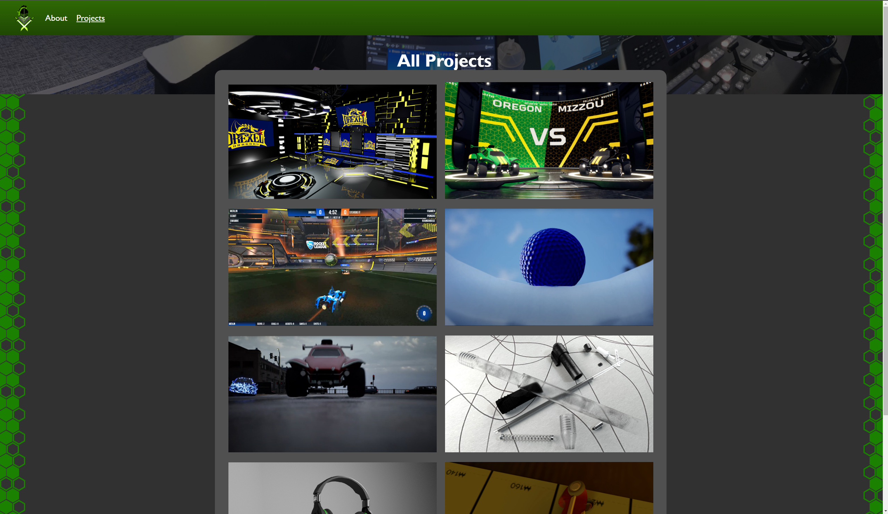

Everyone needs to display their work somewhere and I chose to use my own website. I disliked using any kind of template website platform as I felt like I was spending a whole lot of money and time just to not quite be able to get the look I really wanted. This lead me to coding my own website.

Above is an old version of the website. I now have rebuilt the website and modified the look. On top of modifying the look I now use Jekyll to make the website better to work on and update. Now rather than coding every page I m able to utilize for loops and markdown files to exapnd the website much faster. This also allows making a small change that can reflect across all my pages which I did not have before.

My main priority for this site was to have a place to display work that I am proud of. I want to be able to showcase those projects and tell a little bit about each one just like this one here. This website is definitely something I am very proud of and have learned so much from working on it.

My first bit of coding with HTML/CSS was making custom overlays for Rocket League(Seen in another project) I am 100% self taught using videos off youtube and days of looking at forums and documentation. I know I still have much more to learn but i am happy where I am at right now.

I am hoping to continuously be working on this project and seeing many different iterations. I have already been through a lot of design changes and I am sure there will be more changes moving forward.

On top of creating my own website I also created a website for my girlfriend with a similar layout but different designs for her crafting branding.